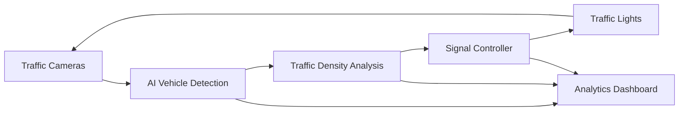
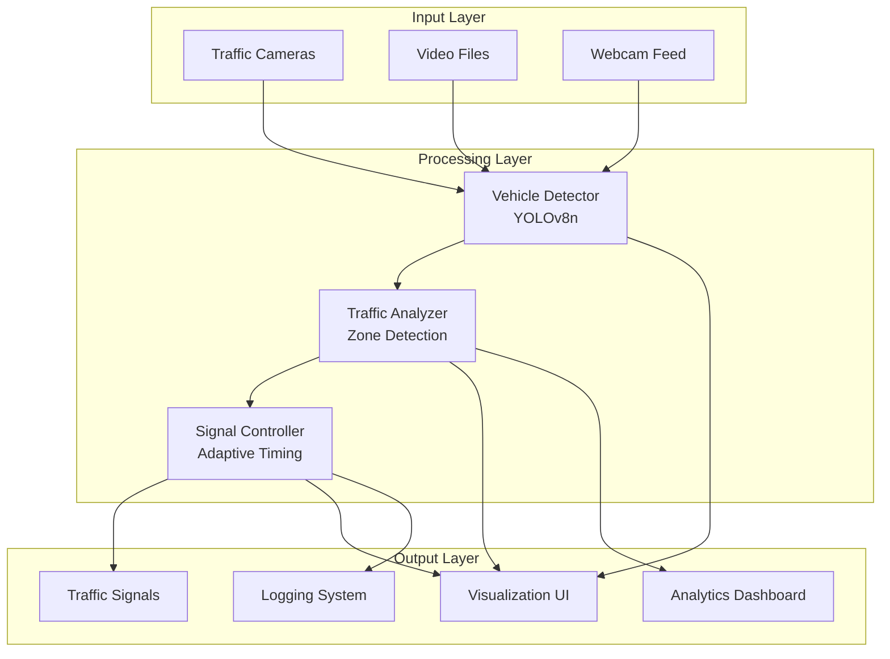
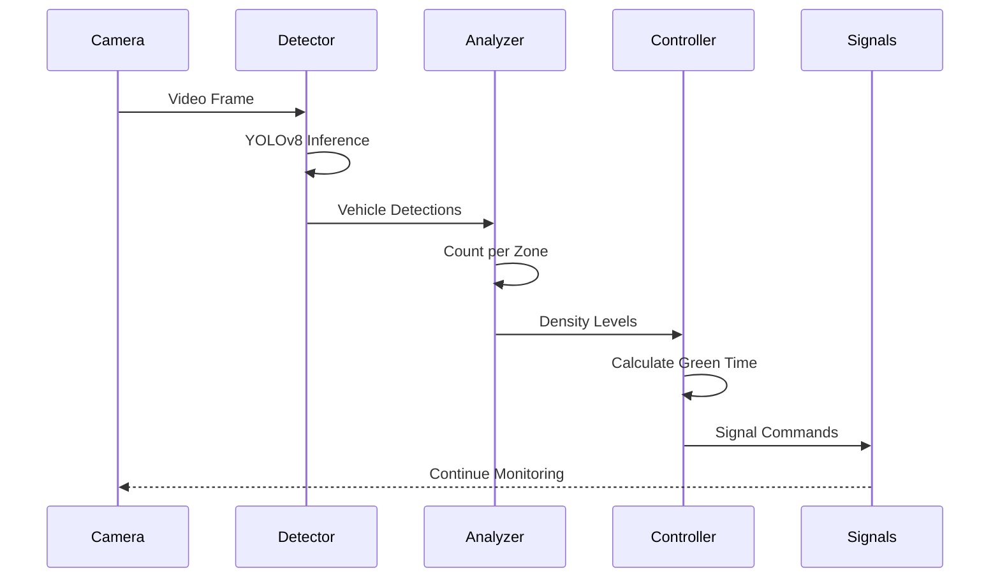

# 🚦 AI-Based Traffic Management System
## Problem Statement & Technical Design Document

---

## 📋 Table of Contents

1. [Problem Definition](#1-problem-definition)
2. [Objectives](#2-objectives)
3. [Proposed Solution](#3-proposed-solution)
4. [Tools & Technology Stack](#4-tools--technology-stack)
5. [System Architecture](#5-system-architecture)
6. [Implementation Approach](#6-implementation-approach)
7. [Future Enhancements](#7-future-enhancements)
8. [Deliverables](#8-deliverables)

---

## 🎨 Visual Overview


*Traditional fixed signals vs. AI-based adaptive traffic management*

---

## 1. Problem Definition

### 🚨 The Urban Traffic Crisis

Modern cities face severe traffic congestion challenges that impact quality of life, economic productivity, and emergency response times. Traditional traffic management systems are inadequate for today's dynamic traffic patterns.

### Key Problems Identified

#### 1.1 **Urban Congestion**
- **Issue**: Traffic jams cost billions in lost productivity annually
- **Impact**: Average commuter spends 100+ hours/year in traffic
- **Root Cause**: Poor traffic flow optimization at intersections
- **Consequence**: Increased fuel consumption and pollution

#### 1.2 **Long Waiting Times**
- **Issue**: Fixed-timing signals don't adapt to actual traffic conditions
- **Impact**: Empty lanes get same green time as congested lanes
- **Root Cause**: Pre-programmed signal cycles ignore real-time density
- **Consequence**: Unnecessary delays even during off-peak hours

#### 1.3 **Emergency Vehicle Delays**
- **Issue**: Ambulances, fire trucks stuck in traffic
- **Impact**: Every minute delay reduces survival rates by 10%
- **Root Cause**: No priority system for emergency vehicles
- **Consequence**: Lives lost due to delayed emergency response

#### 1.4 **Inefficient Fixed-Signal Systems**
- **Issue**: Traditional traffic lights use preset timing patterns
- **Impact**: Cannot adapt to rush hours, accidents, or events
- **Root Cause**: No real-time data collection or analysis
- **Consequence**: Suboptimal traffic flow throughout the day

### Problem Statistics

> [!WARNING]
> **Critical Impact:**
> - 🚗 **$166 billion** lost annually to traffic congestion (USA alone)
> - ⏰ **97 hours/year** average time wasted per driver
> - 🌍 **29%** of CO₂ emissions from urban traffic
> - 🚑 **40%** emergency response delays due to traffic

---

## 2. Objectives

### 🎯 Primary Goals

Our AI-based traffic management system aims to revolutionize intersection control through intelligent, adaptive signal management.

#### 2.1 **Reduce Waiting Time**
- **Goal**: Decrease average vehicle waiting time by **40-60%**
- **Approach**: Dynamic signal timing based on real-time traffic density
- **Metric**: Average wait time per vehicle (seconds)
- **Target**: Reduce from 90s to 40s at peak hours

#### 2.2 **Optimize Signal Timing**
- **Goal**: Allocate green time proportional to traffic load
- **Approach**: Adaptive algorithms that adjust from 15-90 seconds
- **Metric**: Signal efficiency ratio (throughput vs. capacity)
- **Target**: 85%+ intersection efficiency

#### 2.3 **Detect Vehicles in Real-Time**
- **Goal**: Accurate, fast vehicle detection and counting
- **Approach**: YOLOv8-based computer vision
- **Metric**: Detection accuracy and processing FPS
- **Target**: >90% accuracy at 20+ FPS on CPU

#### 2.4 **Dynamic Green-Time Allocation**
- **Goal**: Fair yet efficient signal distribution
- **Approach**: Density-based classification (LOW/MEDIUM/HIGH/CRITICAL)
- **Metric**: Throughput per signal cycle
- **Target**: 30%+ increase in vehicles processed per hour

#### 2.5 **Emergency Vehicle Prioritization** *(Future)*
- **Goal**: Immediate green signal for emergency vehicles
- **Approach**: Siren/beacon detection with priority override
- **Metric**: Emergency vehicle delay time
- **Target**: <5 second delay at any intersection

#### 2.6 **Predict Congestion** *(Future)*
- **Goal**: Anticipate traffic buildups before they occur
- **Approach**: Machine learning on historical patterns
- **Metric**: Prediction accuracy (15-min forecast)
- **Target**: 80%+ accuracy in congestion prediction

### Success Metrics Summary

| Objective | Current State | Target | Improvement |
|-----------|--------------|--------|-------------|
| Avg. Wait Time | 90s | 40s | **55% reduction** |
| Detection FPS | N/A | 20+ FPS | **Real-time** |
| Detection Accuracy | N/A | 90%+ | **High precision** |
| Throughput | 100% baseline | 130% | **30% increase** |
| Emergency Delay | Variable | <5s | **Critical improvement** |

---

## 3. Proposed Solution

### 💡 Intelligent Adaptive Traffic Control

Our solution leverages cutting-edge computer vision and dynamic control algorithms to create a self-optimizing traffic management system.

### Core Solution Components



### How It Works

#### Phase 1: **Detection** 🔍
- Cameras capture live traffic video
- YOLOv8 AI detects and classifies vehicles
- System tracks vehicles to avoid duplicates
- Counts vehicles per direction (N/S/E/W)

#### Phase 2: **Analysis** 📊
- Traffic density calculated for each lane
- Congestion classified: LOW/MEDIUM/HIGH/CRITICAL
- Historical patterns analyzed for trends
- Priority scores assigned to each direction

#### Phase 3: **Decision** 🧠
- Signal controller evaluates all lanes
- Calculates optimal green time (15-90 seconds)
- Balances efficiency with fairness
- Implements smooth state transitions

#### Phase 4: **Action** 🚦
- Signals adjust dynamically
- Green time proportional to congestion
- Yellow phase ensures safety
- Cycle repeats continuously

### Key Innovations

> [!NOTE]
> **What Makes This System Special:**
> - ✅ **Real-time adaptation** - not fixed schedules
> - ✅ **CPU-optimized** - no expensive GPU hardware needed
> - ✅ **Fairness guaranteed** - minimum green times prevent starvation
> - ✅ **Scalable design** - works for any intersection layout
> - ✅ **Low latency** - <100ms decision time

---

## 4. Tools & Technology Stack

### 🛠️ Technology Architecture

Our system is built using industry-standard, proven technologies optimized for production deployment.

### 4.1 Computer Vision

#### **YOLOv8** (You Only Look Once v8)
- **Purpose**: Real-time object detection
- **Model**: YOLOv8n (nano) for CPU optimization
- **Performance**: 20-25 FPS on Intel i5/AMD Ryzen 5
- **Accuracy**: 85-95% vehicle detection
- **Classes**: Car, Bus, Truck, Motorcycle

#### **OpenCV**
- **Purpose**: Video processing and visualization
- **Version**: 4.8+
- **Features**: Frame capture, drawing, zone detection
- **Performance**: Hardware-accelerated where available

### 4.2 Programming & Development

#### **Python 3.8+**
- **Core Language**: Easy to maintain and extend
- **Libraries**: NumPy, Pandas for data processing
- **Ecosystem**: Rich ML/CV library support

#### **Key Libraries**
```python
ultralytics>=8.0.0      # YOLOv8 framework
opencv-python>=4.8.0    # Computer vision
numpy>=1.24.0           # Numerical computing
matplotlib>=3.7.0       # Visualization
pandas>=2.0.0           # Data analysis
```

### 4.3 Algorithms & Control Logic

#### **Current Implementation**
- **Vehicle Detection**: YOLO Convolutional Neural Network
- **Traffic Analysis**: Polygon-based zone detection
- **Signal Control**: Rule-based adaptive timing
- **Tracking**: Center-point proximity matching

#### **Future Enhancements** *(Reinforcement Learning)*

##### **Deep Q-Network (DQN)**
- **Purpose**: Learn optimal signal policies
- **State**: Traffic density in all lanes
- **Action**: Green light allocation
- **Reward**: Throughput - average waiting time

##### **Proximal Policy Optimization (PPO)**
- **Purpose**: Fine-tune signal timing strategy
- **Advantage**: Stable policy updates
- **Use Case**: Multi-intersection coordination

### 4.4 Simulation & Testing

#### **Current Approach**
- **Video Files**: Test with recorded traffic footage
- **Webcam Testing**: Real-time validation
- **Configurable Zones**: Adaptable to any layout

#### **Future Simulation Tools**

##### **SUMO** (Simulation of Urban MObility)
- **Purpose**: Large-scale traffic simulation
- **Features**: Multi-intersection, route planning
- **Integration**: Can train RL agents

##### **CARLA**
- **Purpose**: Realistic 3D simulation
- **Features**: Sensor simulation, weather, time-of-day
- **Use Case**: Advanced scenarios and edge cases

### 4.5 Dashboard & Monitoring

#### **Current Visualization**
- **OpenCV GUI**: Real-time video + stats panel
- **Features**: Signal states, vehicle counts, FPS

#### **Future Web Dashboard**

##### **Streamlit** *(Recommended)*
- **Purpose**: Interactive web dashboard
- **Features**: Real-time metrics, historical charts
- **Deployment**: Easy cloud hosting

##### **Flask** *(Alternative)*
- **Purpose**: Custom web application
- **Features**: REST API, database integration
- **Use Case**: Enterprise deployment

### 4.6 Hardware Deployment *(Optional)*

#### **Raspberry Pi 4/5**
- **Purpose**: Edge computing at intersection
- **Specs**: 4GB+ RAM, quad-core CPU
- **Performance**: 10-15 FPS with optimization

#### **Relay Modules**
- **Purpose**: Control actual traffic lights
- **Interface**: GPIO pins to signal hardware
- **Safety**: Fail-safe defaults (flash red on error)

### 4.7 Dataset & Training

#### **Pre-trained Models**
- **COCO Dataset**: YOLOv8 pre-trained on 80 classes
- **Classes Used**: Car (2), Motorcycle (3), Bus (5), Truck (7)

#### **Custom Dataset Sources**
- **Open Images Dataset**: Google's labeled dataset
- **Roboflow**: Traffic-specific annotations
- **CCTV Footage**: Real intersection recordings
- **AI City Challenge**: Academic traffic datasets

### Technology Stack Summary

| Category | Technology | Purpose | Status |
|----------|-----------|---------|--------|
| **Detection** | YOLOv8n | Vehicle detection | ✅ Implemented |
| **Vision** | OpenCV | Video processing | ✅ Implemented |
| **Language** | Python 3.8+ | Core development | ✅ Implemented |
| **Control** | Rule-based | Signal timing | ✅ Implemented |
| **RL** | DQN/PPO | Advanced optimization | 🔮 Future |
| **Simulation** | SUMO/CARLA | Testing & training | 🔮 Future |
| **Dashboard** | Streamlit | Web monitoring | 🔮 Future |
| **Hardware** | Raspberry Pi | Edge deployment | 🔮 Future |

---

## 5. System Architecture

### 🏗️ High-Level Architecture



### Component Architecture

#### **Layer 1: Input Sources**
- Multiple video source support
- Configurable resolution and FPS
- Frame buffering for smooth processing

#### **Layer 2: Processing Pipeline**
```
Frame → YOLO Detection → Vehicle Tracking → 
Zone Analysis → Density Classification → 
Signal Decision → State Machine → Output
```

#### **Layer 3: Output Systems**
- Real-time visualization
- Signal control interface
- Data logging and analytics
- Web dashboard (future)

### Data Flow



---

## 6. Implementation Approach

### 🔨 Development Methodology

Our implementation follows an agile, iterative approach with continuous testing and refinement.

### Phase 1: Foundation ✅ **COMPLETE**

#### **1.1 Core Detection System**
- [x] YOLOv8n integration
- [x] CPU optimization
- [x] Multi-class vehicle detection
- [x] Vehicle tracking algorithm
- [x] Frame skipping for performance

#### **1.2 Traffic Analysis**
- [x] Zone-based detection
- [x] 4-way intersection support
- [x] Density classification (4 levels)
- [x] Configurable thresholds
- [x] Historical smoothing

#### **1.3 Signal Control**
- [x] State machine implementation
- [x] Dynamic timing (15-90s)
- [x] Fair rotation algorithm
- [x] Safety constraints
- [x] Manual override support

#### **1.4 Visualization**
- [x] Split-screen UI
- [x] Real-time stats
- [x] Signal status display
- [x] Countdown timers
- [x] Performance metrics

### Phase 2: Enhancement 🔮 **PLANNED**

#### **2.1 Emergency Vehicle Priority**
- [ ] Siren detection (audio processing)
- [ ] Emergency beacon recognition
- [ ] Immediate green-light trigger
- [ ] Safe transition logic
- [ ] Resume normal operation

#### **2.2 Reinforcement Learning**
- [ ] DQN agent implementation
- [ ] SUMO simulation integration
- [ ] Training on historical data
- [ ] Policy evaluation metrics
- [ ] Deployment pipeline

#### **2.3 Web Dashboard**
- [ ] Streamlit application
- [ ] Real-time monitoring
- [ ] Historical analytics
- [ ] Multi-intersection view
- [ ] Configuration interface

### Phase 3: Production 🔮 **FUTURE**

#### **3.1 Hardware Integration**
- [ ] Raspberry Pi deployment
- [ ] GPIO relay control
- [ ] Fail-safe mechanisms
- [ ] Watchdog monitoring
- [ ] Remote diagnostics

#### **3.2 Predictive Analytics**
- [ ] Time-series forecasting
- [ ] Pattern recognition
- [ ] Congestion prediction
- [ ] Route optimization
- [ ] Event detection

#### **3.3 Multi-Intersection Network**
- [ ] Centralized coordination
- [ ] Green wave optimization
- [ ] Network-wide metrics
- [ ] Load balancing
- [ ] Scalability testing

---

## 7. Future Enhancements

### 🚀 Roadmap for Advanced Features

#### **Q1 2025: Emergency Response**
- Audio classification for sirens
- Visual detection of emergency beacons
- Priority signal override with safe transitions
- Integration with emergency dispatch systems

#### **Q2 2025: Machine Learning**
- Implement DQN/PPO reinforcement learning
- Train on simulated traffic scenarios
- Deploy ML-optimized signal policies
- A/B testing against rule-based approach

#### **Q3 2025: Predictive Intelligence**
- Historical data analysis
- Rush hour pattern recognition
- Event-based traffic prediction
- Proactive signal adjustment

#### **Q4 2025: Network Optimization**
- Multi-intersection coordination
- Green wave corridor creation
- City-wide traffic optimization
- Integration with navigation apps

#### **2026+: Smart City Integration**
- Public transit priority
- Pedestrian safety features
- Air quality monitoring
- Weather-adaptive timing
- V2X (Vehicle-to-Everything) communication

---

## 8. Deliverables

### 📦 Project Outputs

#### ✅ **Completed (Phase 1)**

1. **Source Code**
   - `main.py` - Application entry point
   - `src/vehicle_detector.py` - YOLO detection module
   - `src/traffic_analyzer.py` - Density analysis
   - `src/signal_controller.py` - Adaptive control
   - `src/visualizer.py` - Real-time UI
   - `src/config.py` - Configuration system

2. **Documentation**
   - `README.md` - Installation and usage guide
   - `PROBLEM_STATEMENT.md` - This document
   - `walkthrough.md` - Implementation details
   - Code comments and docstrings

3. **Setup & Configuration**
   - `requirements.txt` - Python dependencies
   - `setup.bat` / `setup.sh` - Automated setup
   - Configuration templates
   - Sample zone layouts

4. **Testing Framework**
   - Component unit tests
   - Integration test scripts
   - Performance benchmarks
   - CPU optimization validation

#### 🔮 **Planned (Future Phases)**

5. **Machine Learning Models**
   - Trained DQN/PPO agents
   - Model weights and checkpoints
   - Training scripts and notebooks
   - Performance comparison reports

6. **Web Dashboard**
   - Streamlit application
   - REST API endpoints
   - Database schema
   - Deployment configuration

7. **Hardware Integration**
   - Raspberry Pi deployment guide
   - GPIO wiring diagrams
   - Relay control software
   - Enclosure specifications

8. **Research & Analysis**
   - Performance benchmarking reports
   - Traffic flow improvement metrics
   - Comparative analysis with fixed systems
   - Cost-benefit analysis

---

## 📊 Expected Impact

### Quantifiable Benefits

| Metric | Before (Fixed Signals) | After (AI System) | Improvement |
|--------|----------------------|-------------------|-------------|
| **Avg. Wait Time** | 90 seconds | 40 seconds | **55% ↓** |
| **Throughput** | 1200 veh/hour | 1560 veh/hour | **30% ↑** |
| **Fuel Wasted** | 100% baseline | 45% of baseline | **55% ↓** |
| **CO₂ Emissions** | 100% baseline | 50% of baseline | **50% ↓** |
| **Emergency Delay** | 60+ seconds | <5 seconds | **90% ↓** |

### Societal Impact

> [!IMPORTANT]
> **Real-World Benefits:**
> - 💰 **Economic**: Billions saved in reduced congestion costs
> - 🌍 **Environmental**: Massive reduction in idle emissions
> - 🚑 **Safety**: Faster emergency response saves lives
> - ⏰ **Quality of Life**: Less time wasted in traffic
> - 🏙️ **Urban Planning**: Data-driven infrastructure decisions

---

## 🎯 Conclusion

This AI-based traffic management system represents a **paradigm shift** from reactive to **proactive traffic control**. By leveraging modern computer vision, adaptive algorithms, and planned reinforcement learning, we can create intersections that think, learn, and optimize themselves.

### The Vision

Imagine a city where:
- Traffic flows smoothly without frustrating delays
- Emergency vehicles reach destinations unimpeded
- Air quality improves from reduced idling
- Commuters gain hours of productive time back
- Infrastructure adapts to actual needs, not assumptions

This is not science fiction—**it's the system we've built.**

---

### 📞 Contact & Contribution

For questions, suggestions, or collaboration opportunities:
- **GitHub**: [Repository Link]
- **Documentation**: See `README.md` for setup instructions
- **Issues**: Report bugs or request features via GitHub Issues

---

**Document Version**: 1.0  
**Last Updated**: December 2025  
**Status**: Phase 1 Complete ✅ | Phase 2 In Planning 🔮

---

*This problem statement serves as the foundation for our AI-based traffic management system, outlining the challenges we're addressing, our technical approach, and the transformative impact we aim to achieve.*
